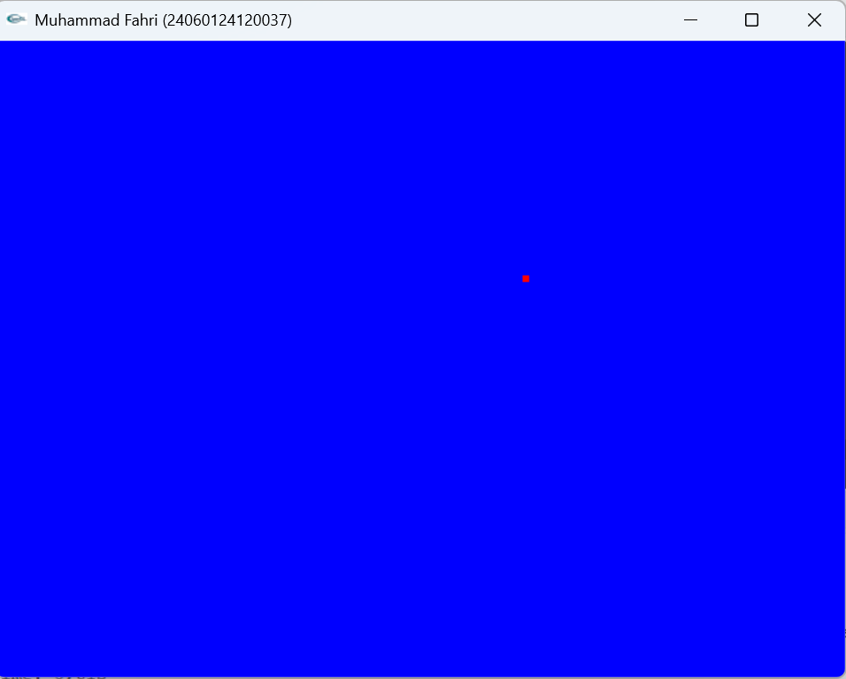
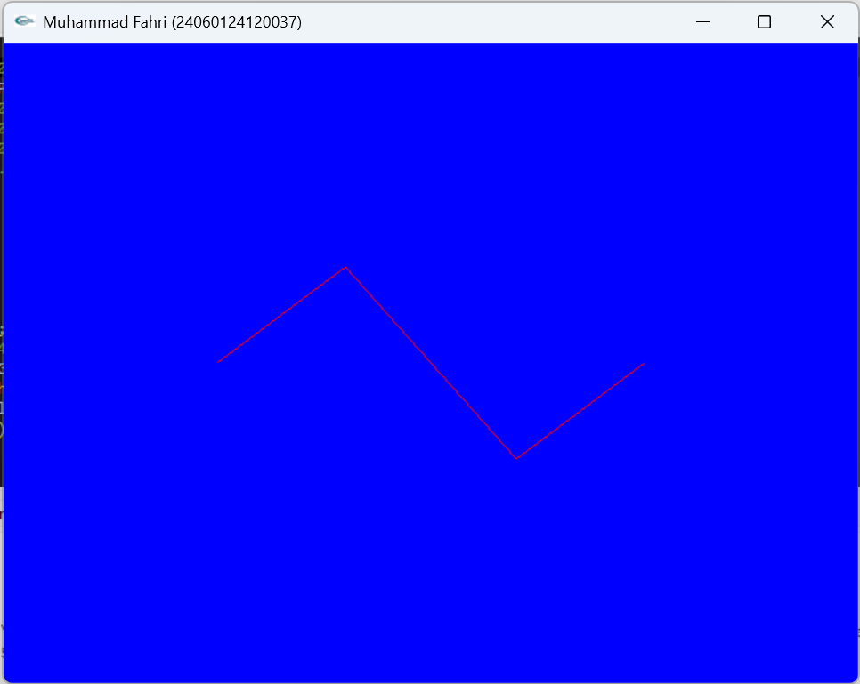
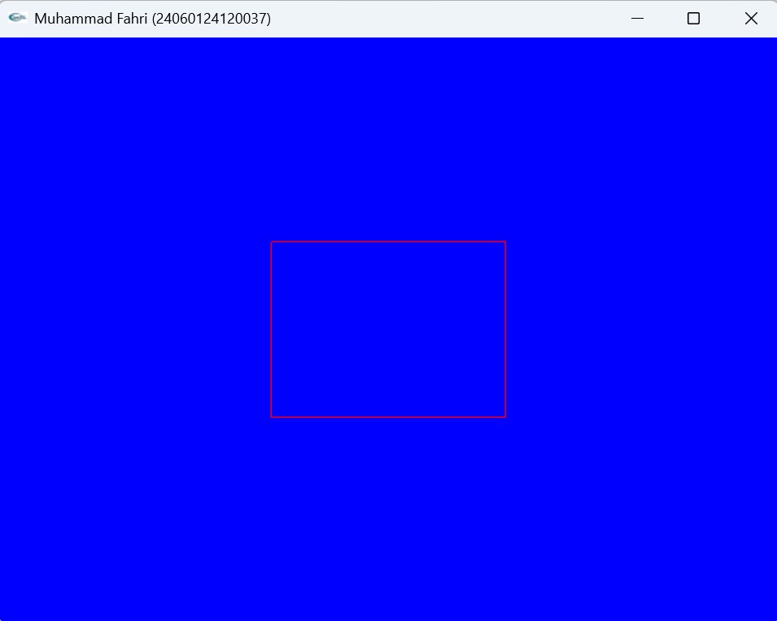
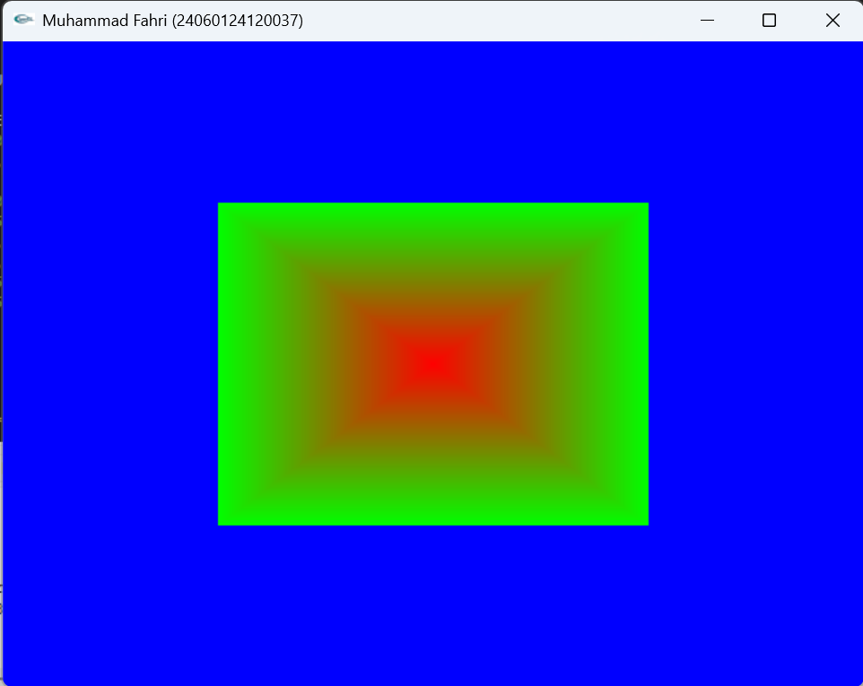
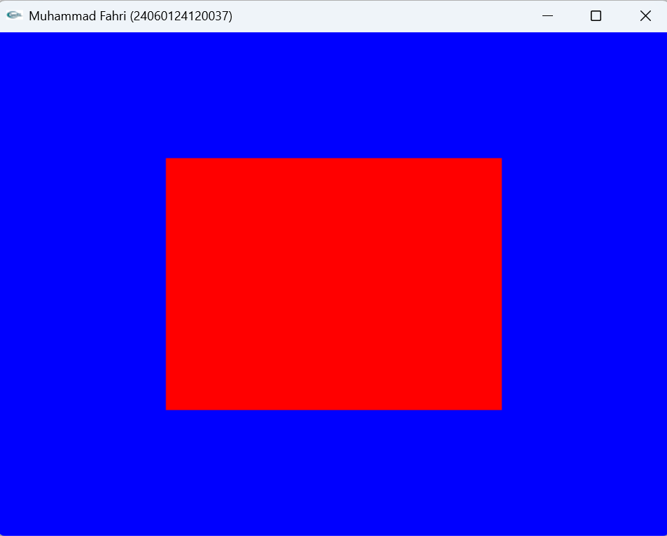
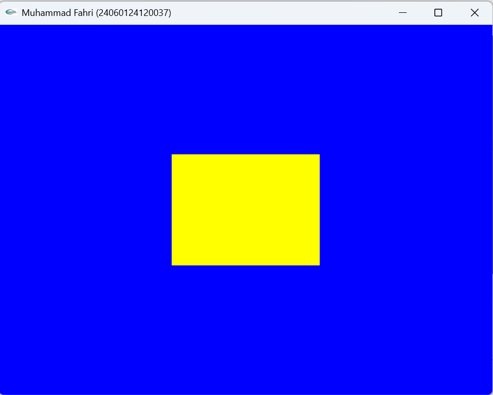
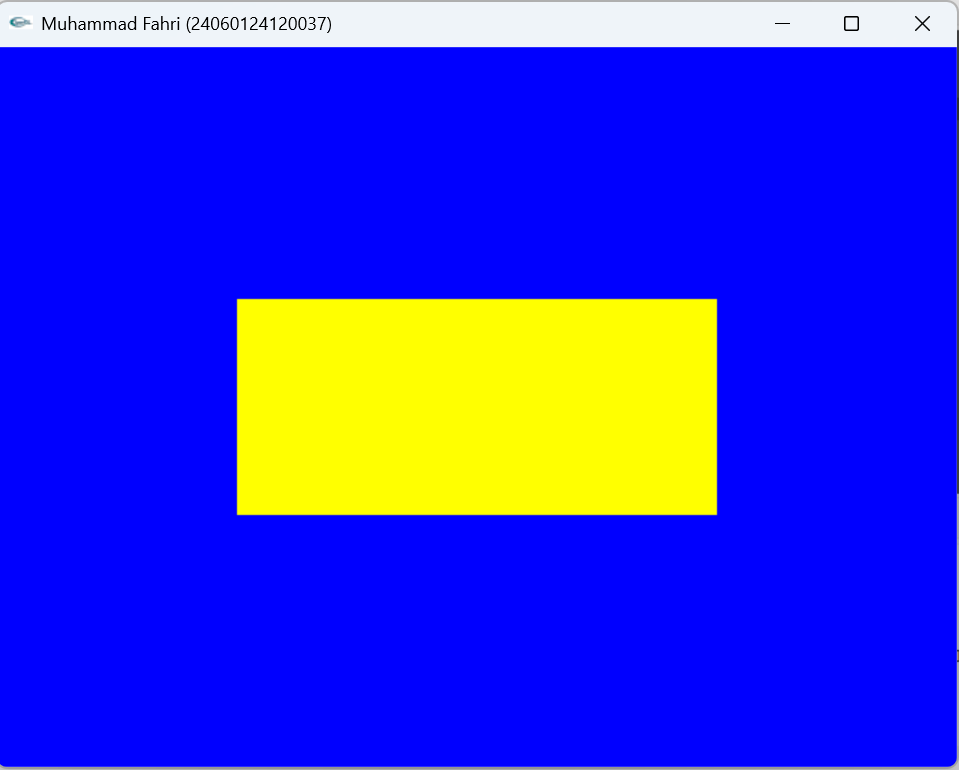

# LAPORAN PRAKTIKUM GTIA2

---

**Nama**  : Muhammad Fahri  
**NIM**   : 24060124120037  
**Lab**   : A2  
**Kelas** : A  

---

# Primitif Drawing

Primitif drawing merupakan teknik dasar dalam grafika komputer untuk menggambar objek sederhana seperti titik, garis, segitiga, dan segiempat menggunakan fungsi bawaan OpenGL.

---

## 1. Titik (GL_POINTS)

Titik merupakan bentuk paling dasar dalam grafika komputer. Pada OpenGL, titik dapat dibuat menggunakan `GL_POINTS`. Ukuran titik dapat diatur menggunakan fungsi `glPointSize()`.

---

## 2. Garis (GL_LINES)

Garis digunakan untuk menghubungkan dua titik koordinat. Pada OpenGL, garis dibuat menggunakan `GL_LINES` dengan dua buah vertex sebagai titik awal dan titik akhir.

---

## 3. Segitiga (GL_TRIANGLES)

Segitiga merupakan bentuk poligon paling sederhana yang terdiri dari tiga titik (vertex). Pada OpenGL, segitiga dibuat menggunakan `GL_TRIANGLES`.

---

## 4. Segiempat (GL_QUADS / glRectf)

Segiempat merupakan bentuk poligon dengan empat titik sudut. Pada OpenGL dapat dibuat menggunakan `GL_QUADS` atau fungsi `glRectf()`.

---

# Primitif Drawing Lanjutan

Selain primitive dasar, OpenGL juga menyediakan beberapa primitive lain untuk membuat bentuk yang lebih kompleks.

---

## 5. GL_LINE_STRIP

`GL_LINE_STRIP` digunakan untuk menggambar garis yang saling terhubung dari titik pertama hingga titik terakhir. Setiap titik akan dihubungkan dengan garis secara berurutan.

Contoh penggunaan: membuat grafik atau pola garis yang saling tersambung.

---

## 6. GL_LINE_LOOP

`GL_LINE_LOOP` hampir sama dengan `GL_LINE_STRIP`, namun garis terakhir akan otomatis terhubung kembali ke titik pertama sehingga membentuk loop tertutup.

Contoh penggunaan: membuat bentuk poligon sederhana.

---

## 7. GL_TRIANGLE_FAN

`GL_TRIANGLE_FAN` digunakan untuk membuat beberapa segitiga yang memiliki satu titik pusat yang sama. Setiap segitiga berbagi satu vertex pusat.

Primitive ini sering digunakan untuk membuat bentuk seperti kipas atau lingkaran sederhana.

---

## 8. GL_TRIANGLE_STRIP

`GL_TRIANGLE_STRIP` digunakan untuk membuat rangkaian segitiga yang saling berbagi sisi. Dengan teknik ini, pembuatan banyak segitiga menjadi lebih efisien.

Contoh penggunaan: membuat permukaan atau mesh sederhana.

---

## 9. GL_QUADS

`GL_QUADS` digunakan untuk membuat objek berbentuk segiempat dengan empat vertex.

Primitive ini biasanya digunakan untuk membuat objek seperti persegi atau persegi panjang.

---

## 10. GL_QUAD_STRIP

`GL_QUAD_STRIP` digunakan untuk membuat rangkaian segiempat yang saling berbagi sisi. Dengan primitive ini, beberapa segiempat dapat digambar secara berurutan dengan lebih efisien.

---

# Kesimpulan

Dari praktikum ini dapat dipahami bahwa OpenGL menyediakan berbagai jenis primitive drawing untuk membangun objek grafis. Primitive tersebut dapat digunakan untuk membuat bentuk sederhana hingga objek yang lebih kompleks dalam grafika komputer.
