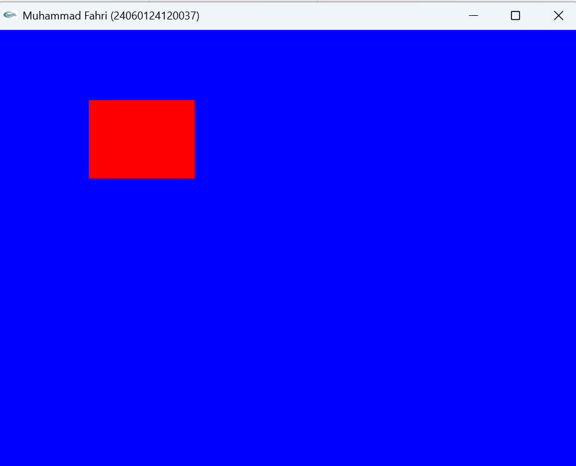
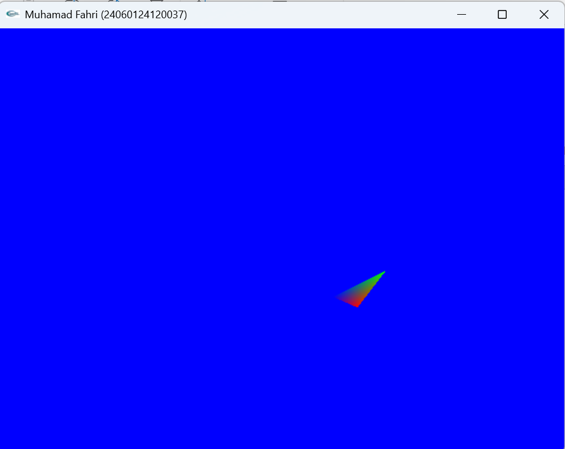
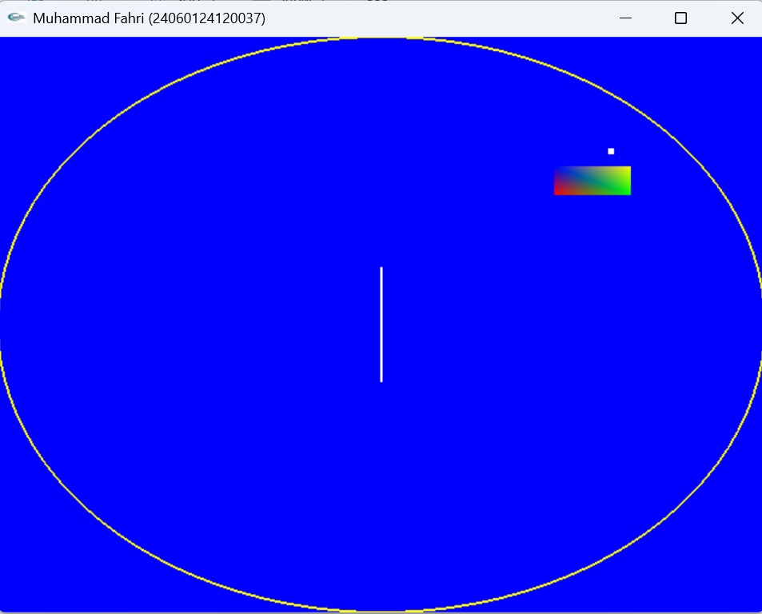
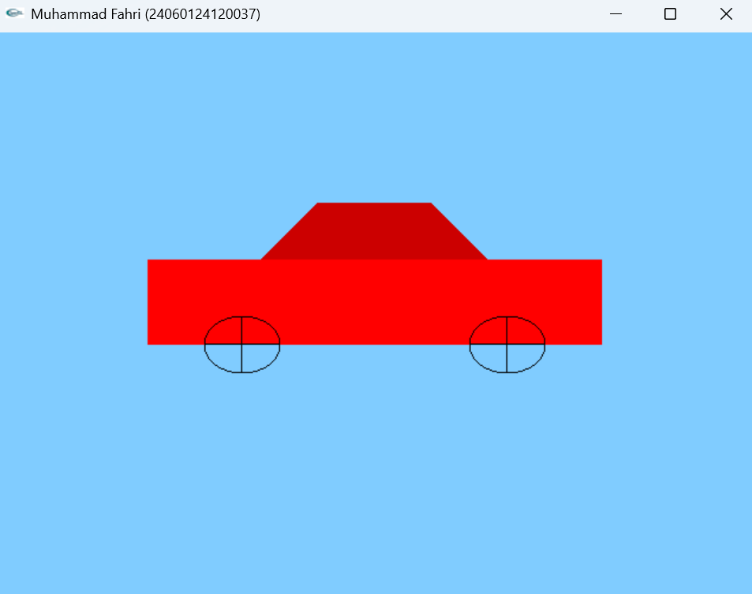

# LAPORAN PRAKTIKUM GTIA2

---

**Nama**  : Muhammad Fahri  
**NIM**   : 24060124120037  
**Lab**   : A2  
**Kelas** : A  

---

# Transformasi dan Objek 2D pada OpenGL

Pada praktikum ini dipelajari bagaimana membuat objek grafika 2D menggunakan OpenGL dengan memanfaatkan **object primitif** serta **transformasi grafika** seperti translasi dan rotasi. Selain itu digunakan juga **matrix stack** untuk mengatur transformasi beberapa objek secara terpisah.

---

# 1. Translasi

Translasi merupakan transformasi yang digunakan untuk **memindahkan posisi objek** dari satu titik ke titik lain tanpa mengubah bentuk atau orientasinya.

Pada OpenGL translasi dilakukan menggunakan fungsi:

```
glTranslatef(x, y, z);
```

Keterangan:

- **x** : perpindahan pada sumbu X  
- **y** : perpindahan pada sumbu Y  
- **z** : perpindahan pada sumbu Z  

Contoh penggunaan translasi:

```
glTranslatef(0.25, -0.25, 0);
```



---

# 2. Rotasi

Rotasi merupakan transformasi yang digunakan untuk **memutar objek terhadap suatu sumbu**.

Pada OpenGL rotasi dilakukan menggunakan fungsi:

```
glRotatef(angle, x, y, z);
```

Keterangan:

- **angle** : besar sudut rotasi dalam derajat  
- **x, y, z** : menentukan sumbu rotasi  

Contoh rotasi:

```
glRotatef(60.0, 0.0, 0.0, 1.0);
```

Objek diputar **60 derajat terhadap sumbu Z**.



---

# 3. Stack Object (Matrix Stack)

Matrix stack digunakan untuk **menyimpan dan mengembalikan transformasi matriks** sehingga transformasi pada satu objek tidak mempengaruhi objek lainnya.

Fungsi yang digunakan:

```
glPushMatrix();
glPopMatrix();
```

Penjelasan:

- **glPushMatrix()** → menyimpan transformasi saat ini  
- **glPopMatrix()** → mengembalikan transformasi sebelumnya  



---

# 4. Mobil 2D Menggunakan Transformasi

Pada bagian ini dibuat sebuah **mobil 2D** menggunakan beberapa **object primitif OpenGL** seperti segiempat dan lingkaran. Mobil juga memanfaatkan transformasi **translasi dan rotasi** untuk mengatur posisi serta pergerakan roda.

Transformasi **matrix stack** digunakan agar setiap bagian mobil dapat dimanipulasi tanpa mempengaruhi objek lainnya.

Berikut hasil tampilan mobil 2D yang dibuat pada praktikum ini.



---

# Kesimpulan

Dari praktikum ini dapat disimpulkan bahwa OpenGL menyediakan berbagai fitur untuk membangun objek grafika 2D. Dengan memanfaatkan **object primitif**, objek sederhana dapat dibuat dan kemudian dikombinasikan menjadi objek yang lebih kompleks seperti mobil.

Selain itu, penggunaan **transformasi translasi dan rotasi** sangat penting untuk mengatur posisi dan orientasi objek. Penggunaan **matrix stack** juga membantu dalam mengelola transformasi sehingga setiap objek dapat dimanipulasi secara independen tanpa mempengaruhi objek lainnya.
