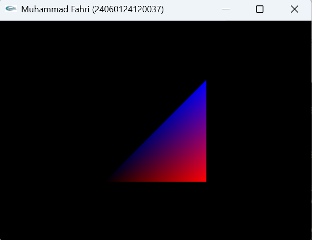
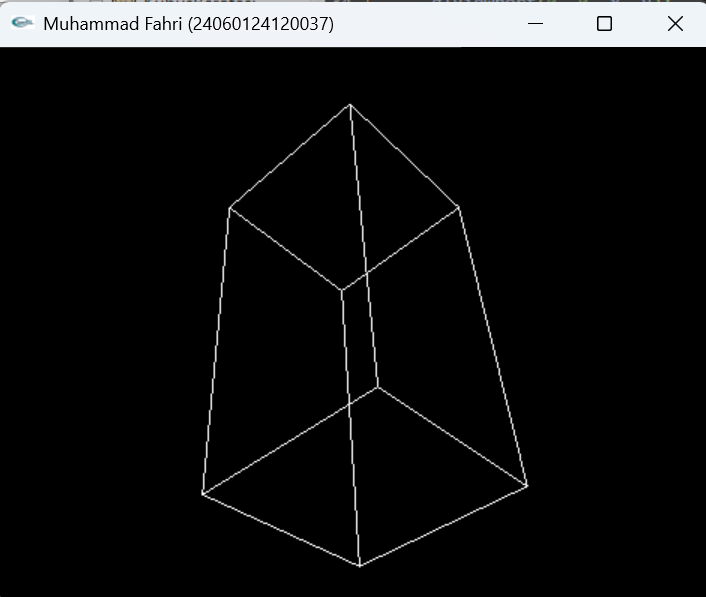
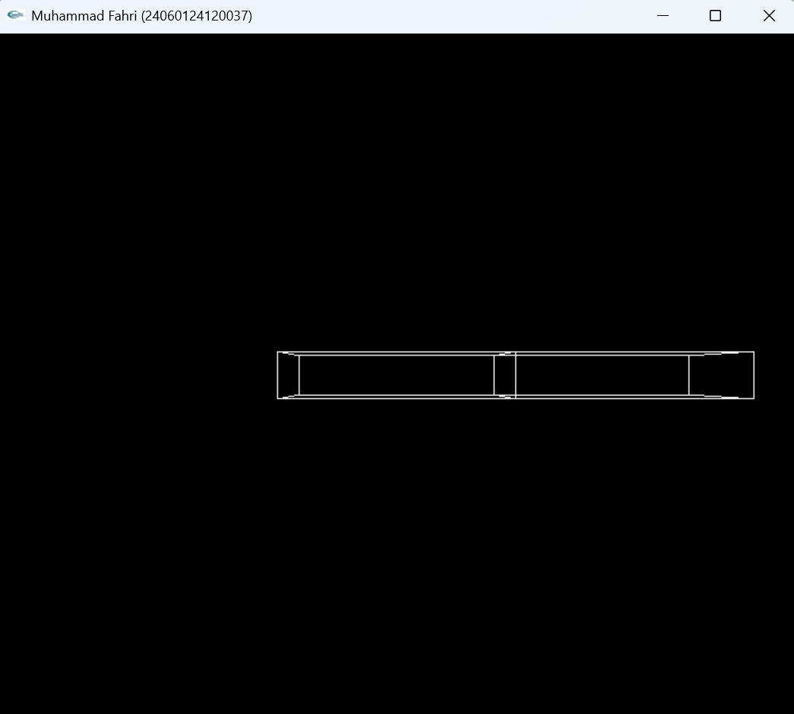
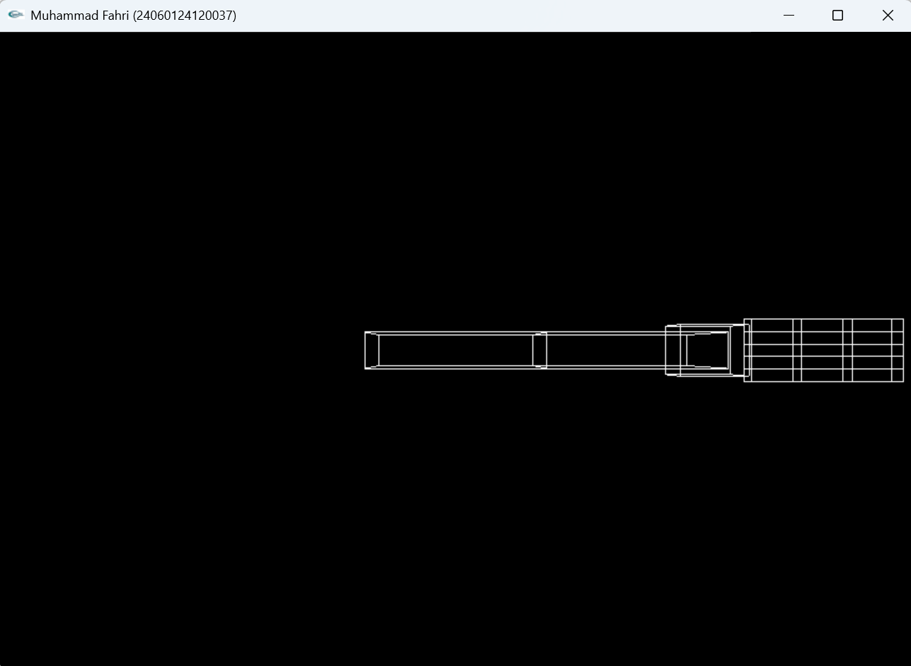

# LAPORAN PRAKTIKUM GTIA2

---

**Nama**  : Muhammad Fahri
**NIM**   : 24060124120037
**Lab**   : A2
**Kelas** : A

---

# Transformasi dan Objek 3D pada OpenGL

Pada praktikum ini dipelajari bagaimana membuat objek grafika **3D** menggunakan OpenGL. Materi yang dibahas meliputi **proyeksi perspektif**, **transformasi rotasi**, serta penggunaan **hierarchical transformation (matrix stack)** untuk membentuk objek kompleks seperti lengan robot.

---

# 1. Proyeksi Perspektif

Proyeksi perspektif digunakan untuk memberikan efek **kedalaman (depth)** sehingga objek terlihat lebih realistis.

```
gluPerspective(fov, aspect, near, far);
```

Contoh:

```
gluPerspective(40.0, (GLdouble)x/(GLdouble)y, 0.5, 20.0);
```



Gambar di atas menunjukkan hasil proyeksi perspektif pada objek 3D.

---

# 2. Kubus Berotasi

Pada bagian ini dibuat objek **kubus 3D** yang berputar pada sumbu X, Y, dan Z.

```
glRotatef(xRotated, 1.0, 0.0, 0.0);
glRotatef(yRotated, 0.0, 1.0, 0.0);
glRotatef(zRotated, 0.0, 0.0, 1.0);
```

Kubus digambar dengan:

```
glutWireCube(1.0);
```



Gambar menunjukkan kubus yang mengalami transformasi rotasi secara kontinu.

---

# 3. Lengan Bergerak (Robot Arm)

Pada bagian ini dibuat simulasi **lengan robot** dengan dua bagian:

* Shoulder (lengan atas)
* Elbow (lengan bawah)

Transformasi utama:

```
glTranslatef(...)
glRotatef(...)
```

Matrix stack:

```
glPushMatrix();
glPopMatrix();
```



Konsep:

* Rotasi shoulder → semua bagian ikut bergerak
* Rotasi elbow → hanya bagian bawah yang berger

---

# 4. Tangan Bergerak (Robot Hands)

Pada bagian ini dibuat simulasi **Tangan robot** dengan bagian lengan robot + 5 jari robot yang bisa mengepal dan membuka:

* Jari telapak
* jari mengepal




Konsep:

* Rotasi → semua jari ikut bergerak

---

# Analisis dan Pengembangan Lengan Robot

---

## 1. Cara Kerja Kode Lengan

Kode lengan robot bekerja dengan menggunakan konsep **hierarchical transformation** dimana setiap bagian lengan saling terhubung secara berurutan.

Prosesnya sebagai berikut:

* Program pertama-tama melakukan **translasi** untuk menentukan posisi awal bahu (shoulder).
* Kemudian dilakukan **rotasi pada shoulder**, yang akan mempengaruhi seluruh bagian lengan.
* Setelah itu, lengan atas digambar menggunakan objek kubus yang telah di-scale menjadi bentuk persegi panjang.
* Program lalu melakukan translasi ke ujung lengan atas untuk menentukan posisi siku (elbow).
* Rotasi pada **elbow** hanya mempengaruhi bagian lengan bawah.
* Lengan bawah digambar dengan cara yang sama menggunakan kubus yang di-scale.

Penggunaan:

* `glPushMatrix()` digunakan untuk menyimpan kondisi transformasi saat ini
* `glPopMatrix()` digunakan untuk mengembalikan kondisi sebelumnya

Dengan cara ini, setiap bagian lengan dapat bergerak secara independen namun tetap terhubung secara struktur.

---

## 2. Penambahan Telapak Tangan dan Jari

Pengembangan dilakukan dengan menambahkan:

* **Telapak tangan** → berupa kubus yang lebih kecil di ujung lengan
* **Jari-jari** → beberapa kubus kecil yang disusun dan dapat bergerak

Konsep yang digunakan:

* Setiap jari menggunakan transformasi sendiri
* Ditambahkan variabel rotasi baru, misalnya:

  * `wrist` → untuk telapak tangan
  * `finger` → untuk jari

Contoh kontrol keyboard:

* `o` → menggerakkan telapak tangan
* `c` → menggerakkan jari

Setiap bagian tetap menggunakan **matrix stack** agar transformasi tidak saling merusak.

Dengan penambahan ini, struktur menjadi:

```
Shoulder → Elbow → Wrist → Fingers
```

---

## 3. Simulasi Transformasi Sumbu (X, Y, Z)

Saat tombol keyboard ditekan, terjadi perubahan nilai sudut yang mempengaruhi transformasi rotasi pada objek.

Contoh:

* Tekan `s` → rotasi shoulder terhadap sumbu Z
* Tekan `e` → rotasi elbow terhadap sumbu Z

Secara konsep koordinat:

* **Sumbu X** → kiri / kanan
* **Sumbu Y** → atas / bawah
* **Sumbu Z** → depan / belakang (arah kamera)

Rotasi dilakukan dengan:

```
glRotatef(sudut, x, y, z);
```

Contoh:

```
glRotatef(shoulder, 0, 0, 1);
```

Artinya:

* Objek diputar terhadap **sumbu Z**

---

### Ilustrasi (Konsep Blok Koordinat)

```
        Y
        ↑
        |
        |
        O ——→ X
       /
      /
     Z
```

* Rotasi Z → seperti jarum jam
* Rotasi X → seperti jungkir
* Rotasi Y → seperti berputar kiri-kanan

---

# Kesimpulan

Dari praktikum ini dapat disimpulkan bahwa OpenGL mampu digunakan untuk membuat objek grafika 3D dengan memanfaatkan berbagai jenis transformasi.

Proyeksi perspektif memberikan efek kedalaman sehingga objek terlihat lebih realistis. Transformasi seperti **rotasi, translasi, dan scaling** sangat penting dalam memanipulasi objek. Selain itu, penggunaan **matrix stack** memungkinkan pembuatan objek kompleks seperti lengan robot dengan hubungan antar bagian yang terstruktur.

Dengan memahami konsep ini, pembuatan animasi dan objek 3D yang lebih kompleks dapat dikembangkan lebih lanjut.
