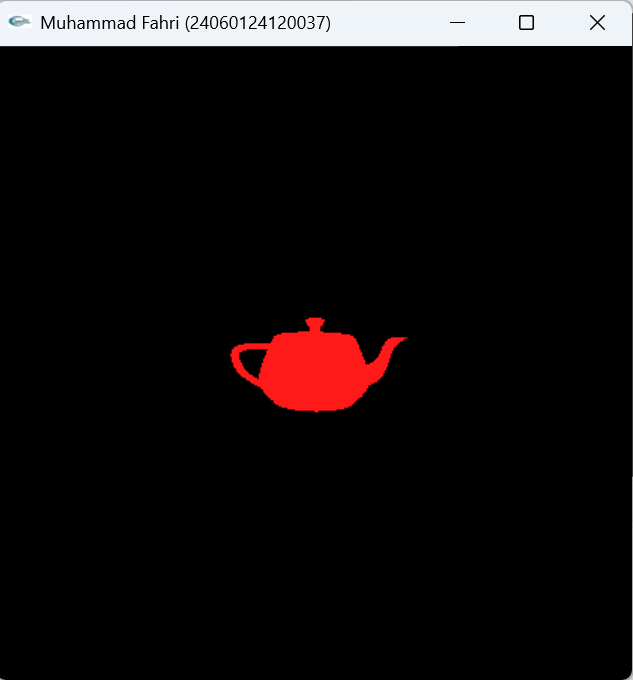
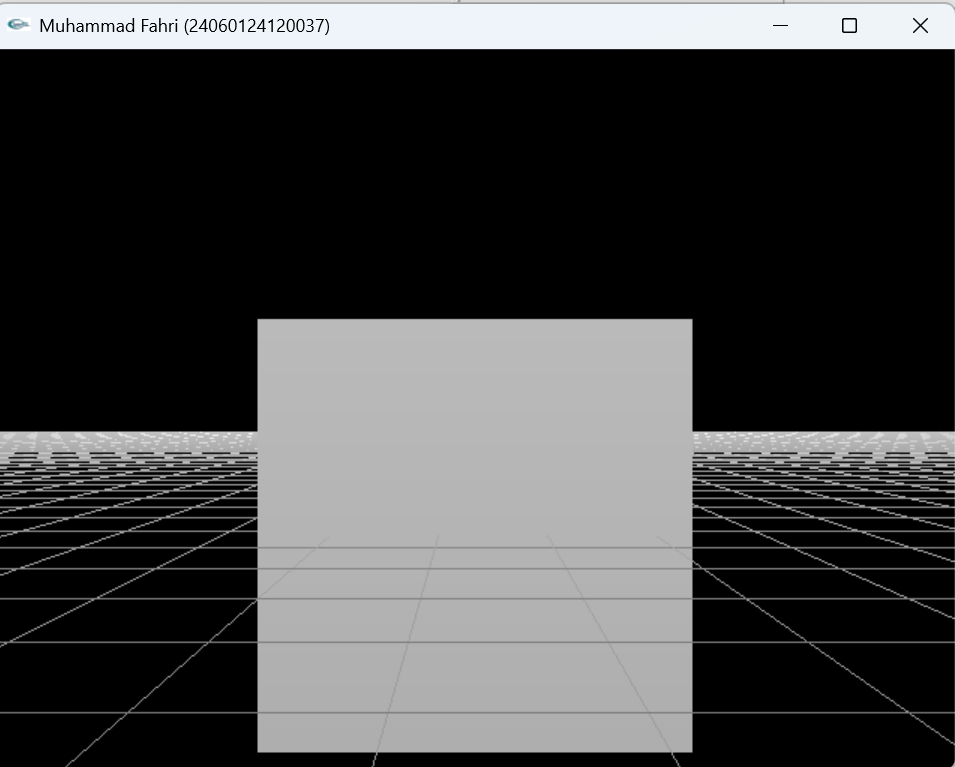
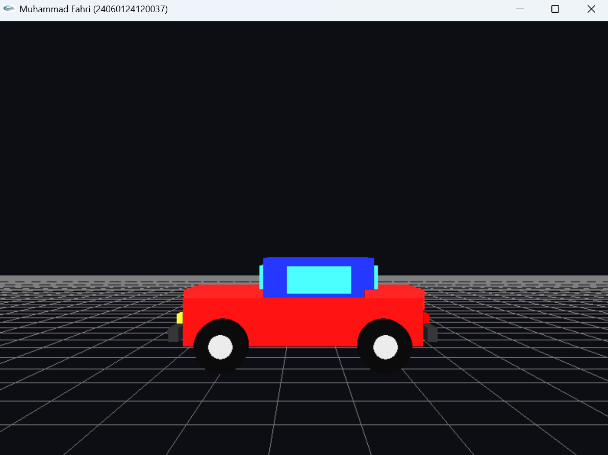

# LAPORAN PRAKTIKUM GTIA2

---

**Nama**  : Muhammad Fahri  
**NIM**   : 24060124120037  
**Lab**   : A2  
**Kelas** : A  

---

# Kamera, Depth, dan Lighting pada OpenGL

Pada praktikum ini dipelajari penggunaan **kamera**, **depth testing**, dan **lighting** pada OpenGL. Program dikembangkan menjadi objek **mobil 3D** yang tersusun dari beberapa balok manual serta roda berbentuk silinder. Objek mobil dibuat dari rangka beberapa sisi agar efek kedalaman dan pencahayaan dapat bekerja dengan baik.

---

# 1. Kamera dalam OpenGL

Pada OpenGL, kamera tidak benar-benar tersedia sebagai objek fisik. Kamera disimulasikan dengan mengatur posisi pandang menggunakan transformasi pada **model view matrix**. Salah satu fungsi utama yang digunakan adalah:

```cpp
gluLookAt(
    eyeX, eyeY, eyeZ,
    centerX, centerY, centerZ,
    upX, upY, upZ
);
```

Pada program, posisi kamera disimpan dalam variabel:

```cpp
float x = 0.0f, y = 3.0f, z = 15.0f;
float lx = 0.0f, ly = 0.0f, lz = -1.0f;
```

Keterangan:

* `x, y, z` adalah posisi kamera.
* `lx, ly, lz` adalah arah kamera melihat.
* Kamera diarahkan dengan `gluLookAt()` menggunakan posisi kamera dan titik tujuan pandang.

Contoh fungsi kamera pada program:

```cpp
void setCamera()
{
    glMatrixMode(GL_MODELVIEW);
    glLoadIdentity();

    gluLookAt(
        x, y, z,
        x + lx, y + ly, z + lz,
        0.0f, 1.0f, 0.0f
    );
}
```



Gambar di atas menunjukkan simulasi kamera yang digunakan untuk melihat objek mobil 3D dari berbagai arah.

---

# 2. Pergerakan Kamera dengan Keyboard

Pergerakan kamera dilakukan dengan mengubah nilai posisi kamera berdasarkan tombol keyboard yang ditekan. Program menggunakan beberapa variabel kontrol:

```cpp
int deltaMoveForward = 0;
int deltaMoveSide = 0;
int deltaMoveVertical = 0;
float deltaAngle = 0.0f;
```

Fungsi pergerakan kamera:

```cpp
void moveCamera()
{
    float speed = 0.12f;

    if (deltaMoveForward != 0)
    {
        x += deltaMoveForward * lx * speed;
        z += deltaMoveForward * lz * speed;
    }

    if (deltaMoveSide != 0)
    {
        x += deltaMoveSide * lz * speed;
        z -= deltaMoveSide * lx * speed;
    }

    if (deltaMoveVertical != 0)
    {
        y += deltaMoveVertical * speed;
    }
}
```

Kontrol keyboard yang digunakan:

| Tombol | Fungsi |
|---|---|
| Panah Atas | Kamera maju |
| Panah Bawah | Kamera mundur |
| Panah Kiri | Kamera geser ke kiri |
| Panah Kanan | Kamera geser ke kanan |
| W | Kamera maju |
| S | Kamera mundur |
| A | Kamera berputar ke kiri |
| D | Kamera berputar ke kanan |
| Q | Kamera naik |
| E | Kamera turun |
| ESC | Keluar dari program |

Callback keyboard didaftarkan pada fungsi `main()`:

```cpp
glutSpecialFunc(pressKey);
glutSpecialUpFunc(releaseKey);

glutKeyboardFunc(keyboardPress);
glutKeyboardUpFunc(keyboardRelease);
```

Dengan cara ini, kamera dapat bergerak ke berbagai sisi dan dapat melihat objek mobil dari sudut yang berbeda.

---

# 3. Proyeksi Perspektif

Proyeksi perspektif digunakan agar objek 3D memiliki efek kedalaman. Objek yang lebih jauh akan terlihat lebih kecil, sehingga tampilan menjadi lebih realistis.

Fungsi yang digunakan:

```cpp
gluPerspective(45.0f, ratio, 0.1f, 1000.0f);
```

Kode pada fungsi `Reshape()`:

```cpp
void Reshape(int w1, int h1)
{
    if (h1 == 0)
        h1 = 1;

    w = w1;
    h = h1;

    ratio = 1.0f * w / h;

    glMatrixMode(GL_PROJECTION);
    glLoadIdentity();

    glViewport(0, 0, w, h);
    gluPerspective(45.0f, ratio, 0.1f, 1000.0f);

    glMatrixMode(GL_MODELVIEW);
    glLoadIdentity();
}
```



Gambar menunjukkan hasil proyeksi perspektif pada objek mobil 3D.

---

# 4. Depth Testing

**Depth testing** digunakan untuk menentukan permukaan mana yang terlihat dan mana yang tertutup oleh objek lain. Tanpa depth testing, objek yang berada di belakang bisa saja terlihat di depan karena urutan penggambaran.

Depth buffer diaktifkan dengan menambahkan `GLUT_DEPTH`:

```cpp
glutInitDisplayMode(GLUT_DEPTH | GLUT_DOUBLE | GLUT_RGBA);
```

Kemudian depth test diaktifkan dengan:

```cpp
glEnable(GL_DEPTH_TEST);
glDepthFunc(GL_LESS);
```

Pada fungsi `display()`, buffer warna dan depth dibersihkan dengan:

```cpp
glClear(GL_COLOR_BUFFER_BIT | GL_DEPTH_BUFFER_BIT);
```

Dengan depth testing, bagian mobil yang berada di belakang akan tertutup oleh bagian mobil yang berada di depan.

---

# 5. Lighting pada OpenGL

Lighting digunakan untuk memberikan efek pencahayaan pada objek 3D. Dengan lighting, objek tidak terlihat datar karena setiap permukaan akan menerima intensitas cahaya yang berbeda.

Lighting diaktifkan dengan:

```cpp
glEnable(GL_LIGHTING);
glEnable(GL_LIGHT0);
```

Sifat cahaya yang digunakan:

```cpp
const GLfloat light_ambient[]  = {0.5f, 0.5f, 0.5f, 1.0f};
const GLfloat light_diffuse[]  = {1.0f, 1.0f, 1.0f, 1.0f};
const GLfloat light_specular[] = {1.0f, 1.0f, 1.0f, 1.0f};
const GLfloat light_position[] = {0.0f, 20.0f, 10.0f, 1.0f};
```

Fungsi lighting pada program:

```cpp
void lighting()
{
    glEnable(GL_DEPTH_TEST);
    glDepthFunc(GL_LESS);

    glEnable(GL_LIGHT0);
    glEnable(GL_NORMALIZE);

    glEnable(GL_COLOR_MATERIAL);
    glColorMaterial(GL_FRONT_AND_BACK, GL_AMBIENT_AND_DIFFUSE);

    glEnable(GL_LIGHTING);

    glLightfv(GL_LIGHT0, GL_AMBIENT,  light_ambient);
    glLightfv(GL_LIGHT0, GL_DIFFUSE,  light_diffuse);
    glLightfv(GL_LIGHT0, GL_SPECULAR, light_specular);
    glLightfv(GL_LIGHT0, GL_POSITION, light_position);
}
```

Komponen lighting:

* **Ambient**: cahaya umum yang menyebar ke semua arah.
* **Diffuse**: cahaya yang membuat permukaan tampak terang sesuai arah cahaya.
* **Specular**: cahaya pantulan yang membuat objek tampak mengkilap.
* **Position**: posisi sumber cahaya pada ruang 3D.

---

# 6. Rangka Mobil 3D

Objek mobil dibuat dari beberapa balok manual. Setiap balok terdiri dari 6 sisi, yaitu:

* Depan
* Belakang
* Kanan
* Kiri
* Atas
* Bawah

Setiap sisi dibuat menggunakan `GL_QUADS` dan diberi normal dengan `glNormal3f()` agar pencahayaan dapat bekerja.

Fungsi balok:

```cpp
void Balok(float panjang, float tinggi, float lebar)
{
    float px = panjang / 2.0f;
    float py = tinggi / 2.0f;
    float pz = lebar / 2.0f;

    glBegin(GL_QUADS);

    glNormal3f(0.0f, 0.0f, 1.0f);
    glVertex3f(-px, -py,  pz);
    glVertex3f( px, -py,  pz);
    glVertex3f( px,  py,  pz);
    glVertex3f(-px,  py,  pz);

    glEnd();
}
```

Pada program lengkap, fungsi `Balok()` dikembangkan menjadi 6 sisi lengkap. Fungsi ini digunakan untuk membuat:

* Badan utama mobil
* Kabin mobil
* Kap depan
* Bagasi belakang
* Bumper
* Lampu
* Kaca mobil

Contoh pembuatan badan utama mobil:

```cpp
glPushMatrix();
glColor3f(0.8f, 0.05f, 0.05f);
glTranslatef(0.0f, 1.2f, 0.0f);
Balok(6.0f, 1.2f, 2.4f);
glPopMatrix();
```



Gambar menunjukkan objek mobil 3D yang tersusun dari beberapa balok manual.

---

# 7. Roda Mobil

Roda dibuat secara manual berbentuk silinder. Bagian roda dibuat dari:

* Sisi luar ban menggunakan `GL_QUAD_STRIP`
* Tutup depan roda menggunakan `GL_TRIANGLE_FAN`
* Tutup belakang roda menggunakan `GL_TRIANGLE_FAN`
* Velg roda menggunakan lingkaran kecil

Contoh fungsi roda:

```cpp
void Roda(float radius, float tebal, int segmen)
{
    int i;
    float sudut;
    float px, py;

    glColor3f(0.03f, 0.03f, 0.03f);

    glBegin(GL_QUAD_STRIP);

    for (i = 0; i <= segmen; i++)
    {
        sudut = 2.0f * PI * i / segmen;

        px = radius * cos(sudut);
        py = radius * sin(sudut);

        glNormal3f(cos(sudut), sin(sudut), 0.0f);

        glVertex3f(px, py, -tebal / 2.0f);
        glVertex3f(px, py,  tebal / 2.0f);
    }

    glEnd();
}
```

Roda diletakkan di empat posisi:

```cpp
glTranslatef(-2.0f, 0.65f,  1.35f); // roda depan kanan
glTranslatef(-2.0f, 0.65f, -1.35f); // roda depan kiri
glTranslatef( 2.0f, 0.65f,  1.35f); // roda belakang kanan
glTranslatef( 2.0f, 0.65f, -1.35f); // roda belakang kiri
```

Dengan penambahan roda, objek mobil menjadi lebih lengkap dan memenuhi nilai tambah pada tugas praktikum.

---

# 8. Analisis Program

---

## 1. Cara Kerja Kamera

Kamera bekerja dengan menyimpan posisi dan arah pandang. Posisi kamera disimpan dalam `x`, `y`, dan `z`, sedangkan arah pandang disimpan dalam `lx`, `ly`, dan `lz`.

Saat tombol ditekan, posisi kamera berubah. Setelah itu, fungsi `setCamera()` dipanggil kembali pada fungsi `display()` agar tampilan diperbarui.

Prosesnya:

* Tombol keyboard ditekan.
* Nilai variabel gerakan berubah.
* Fungsi `moveCamera()` memperbarui posisi kamera.
* Fungsi `setCamera()` mengatur ulang tampilan.
* Objek digambar ulang.

Dengan proses ini, kamera dapat bergerak ke depan, belakang, samping, atas, bawah, serta berputar ke kiri dan kanan.

---

## 2. Cara Kerja `gluLookAt()`

Fungsi `gluLookAt()` digunakan untuk menentukan posisi dan arah pandang kamera.

Struktur fungsi:

```cpp
gluLookAt(
    eyeX, eyeY, eyeZ,
    centerX, centerY, centerZ,
    upX, upY, upZ
);
```

Keterangan:

* `eyeX, eyeY, eyeZ` adalah posisi kamera.
* `centerX, centerY, centerZ` adalah titik yang dilihat kamera.
* `upX, upY, upZ` adalah arah atas kamera.

Pada program:

```cpp
gluLookAt(
    x, y, z,
    x + lx, y + ly, z + lz,
    0.0f, 1.0f, 0.0f
);
```

Artinya kamera berada pada posisi `(x, y, z)` dan melihat ke arah `(x + lx, y + ly, z + lz)`.

---

## 3. Projection dan Model View

Pada OpenGL terdapat dua matrix utama yang digunakan:

### Projection Matrix

Projection matrix digunakan untuk mengatur cara objek 3D diproyeksikan ke layar 2D. Pada program digunakan proyeksi perspektif:

```cpp
glMatrixMode(GL_PROJECTION);
glLoadIdentity();
gluPerspective(45.0f, ratio, 0.1f, 1000.0f);
```

Projection matrix mengatur sudut pandang, rasio layar, jarak minimum, dan jarak maksimum objek yang dapat terlihat.

### Model View Matrix

Model view matrix digunakan untuk mengatur posisi kamera dan transformasi objek. Pada program:

```cpp
glMatrixMode(GL_MODELVIEW);
glLoadIdentity();
```

Model view matrix digunakan bersama `gluLookAt()`, `glTranslatef()`, dan `glRotatef()`.

Keduanya digunakan karena memiliki fungsi berbeda:

* Projection matrix mengatur cara dunia 3D ditampilkan ke layar.
* Model view matrix mengatur posisi kamera dan posisi objek dalam dunia 3D.

---

## 4. Cara Kerja Depth Testing

Depth testing membandingkan jarak setiap pixel dari kamera. Pixel dengan jarak paling dekat akan ditampilkan, sedangkan pixel yang berada di belakang akan disembunyikan.

Pada program:

```cpp
glEnable(GL_DEPTH_TEST);
glDepthFunc(GL_LESS);
```

Artinya OpenGL hanya menampilkan pixel baru jika pixel tersebut memiliki nilai depth lebih kecil atau lebih dekat dari pixel sebelumnya.

---

## 5. Cara Kerja Lighting

Lighting bekerja dengan menghitung interaksi antara sumber cahaya, material objek, dan normal permukaan. Normal permukaan menentukan arah hadap bidang terhadap cahaya.

Pada program, setiap sisi balok diberi normal:

```cpp
glNormal3f(0.0f, 0.0f, 1.0f);
```

Tanpa normal, OpenGL tidak dapat menghitung pencahayaan secara benar. Oleh karena itu, setiap sisi objek mobil harus memiliki `glNormal3f()`.

---

## 6. Analisis Kubus, Grid, dan Pencahayaan

### Kubus / Balok

Kubus atau balok dibuat dari beberapa bidang datar. Setiap bidang dibuat menggunakan `GL_QUADS`. Untuk membuat balok lengkap, dibutuhkan 6 bidang.

Setiap bidang diberi normal berbeda sesuai arah sisi:

* Depan: `(0, 0, 1)`
* Belakang: `(0, 0, -1)`
* Kanan: `(1, 0, 0)`
* Kiri: `(-1, 0, 0)`
* Atas: `(0, 1, 0)`
* Bawah: `(0, -1, 0)`

### Grid

Grid dibuat menggunakan garis-garis pada lantai. Grid digambar dengan `GL_LINES`.

```cpp
glBegin(GL_LINES);
glVertex3f(...);
glVertex3f(...);
glEnd();
```

Lighting dimatikan saat menggambar grid karena grid hanya berupa garis dan tidak memiliki normal permukaan.

```cpp
glDisable(GL_LIGHTING);
Grid();
glEnable(GL_LIGHTING);
```

### Pencahayaan

Pencahayaan dibuat dengan mengaktifkan `GL_LIGHTING` dan `GL_LIGHT0`. Sumber cahaya diletakkan di atas objek:

```cpp
const GLfloat light_position[] = {0.0f, 20.0f, 10.0f, 1.0f};
```

Dengan posisi tersebut, bagian atas mobil menjadi lebih terang dibandingkan bagian bawah atau sisi yang membelakangi cahaya.

---

# 9. Hasil Program

Program menghasilkan sebuah mobil 3D yang terdiri dari:

* Badan utama mobil
* Kabin
* Kap depan
* Bagasi belakang
* Kaca depan dan samping
* Bumper depan dan belakang
* Lampu depan dan belakang
* Empat roda berbentuk silinder

Mobil dapat diamati dari berbagai sudut dengan menggerakkan kamera menggunakan keyboard.


---

# 10. Kendala dan Perbaikan

Selama pengembangan program, terdapat beberapa kendala:

* Variabel `deltaMove` masih digunakan, padahal sudah diganti menjadi `deltaMoveForward`, `deltaMoveSide`, dan `deltaMoveVertical`.
* Fungsi keyboard awal hanya dapat memutar kamera dan belum dapat menggeser kamera ke semua sisi.
* Objek harus memiliki normal agar lighting terlihat benar.
* Grid perlu digambar tanpa lighting agar tetap terlihat jelas.

Perbaikan yang dilakukan:

* Mengganti sistem kontrol kamera menjadi lebih lengkap.
* Menambahkan gerakan maju, mundur, geser kiri, geser kanan, naik, dan turun.
* Menambahkan `glNormal3f()` pada setiap sisi balok.
* Membuat roda manual dengan bentuk silinder.
* Mengaktifkan depth testing dan lighting secara benar.

---

# Kesimpulan

Dari praktikum ini dapat disimpulkan bahwa OpenGL dapat digunakan untuk membuat objek 3D yang realistis dengan memanfaatkan kamera, depth testing, dan lighting.

Kamera pada OpenGL disimulasikan menggunakan `gluLookAt()` dengan mengatur posisi dan arah pandang. Depth testing digunakan untuk menentukan bagian objek yang terlihat dan tersembunyi. Lighting digunakan untuk memberikan efek pencahayaan pada permukaan objek.

Objek mobil 3D berhasil dibuat dari rangka beberapa balok manual yang masing-masing memiliki 6 sisi. Setiap sisi diberi normal agar pencahayaan dapat dihitung dengan benar. Roda mobil dibuat secara manual menggunakan bentuk silinder, sehingga objek menjadi lebih lengkap.

Dengan memahami kamera, depth, lighting, transformasi, dan normal permukaan, pembuatan objek 3D yang lebih kompleks dapat dikembangkan lebih lanjut.
